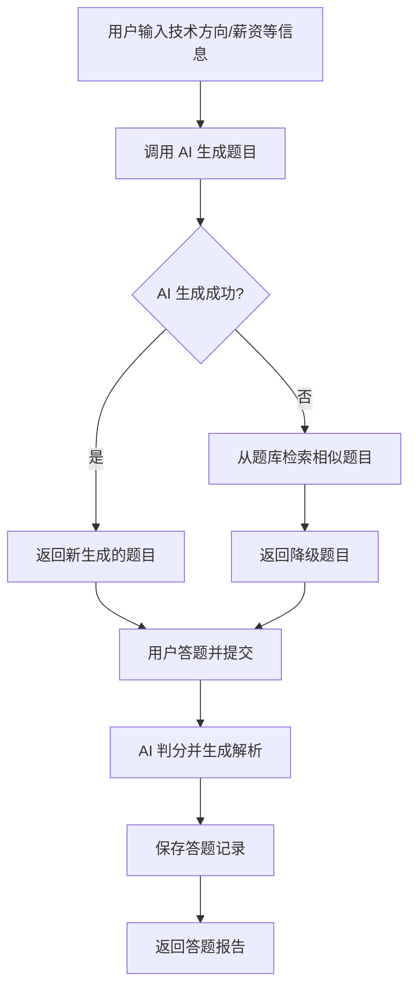
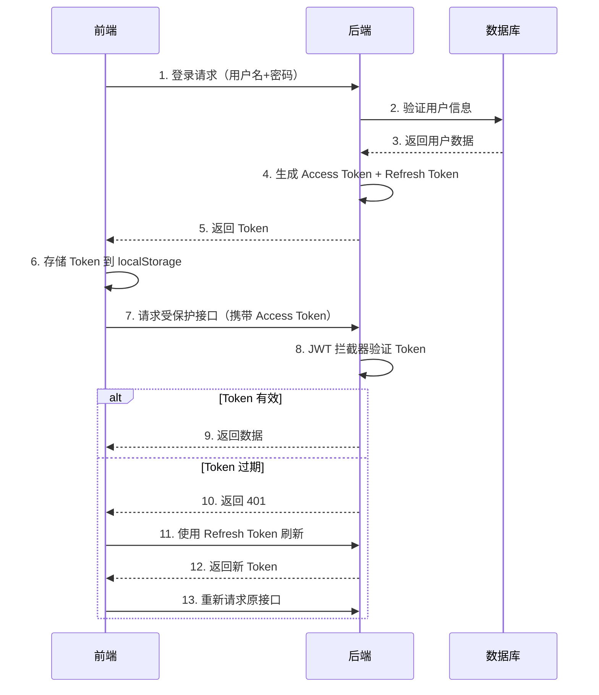

# AI 教育平台 (AI Education Platform)

## 📋 项目概述

AI 教育平台是一个基于 Spring Boot 3 + Vue 3 的智能化教育辅助系统，整合了 AI 大语言模型能力，为开发者提供智能题目生成、答题评估、薪资预测等核心功能。平台采用前后端分离架构，支持用户和管理员两种角色，提供完整的用户管理、题库管理、学习追踪等功能模块。

### 核心特性

- 🤖 **AI 智能题目生成**：基于阿里云通义千问模型，根据用户技术方向、期望薪资等信息智能生成面试题目
- 📊 **智能答题评估**：AI 自动判分并生成详细解析、改进建议和投递公司推荐
- 💰 **薪资评估预测**：根据用户技术栈、项目经历、城市等因素，AI 预测合理薪资区间
- 📚 **学习轨迹追踪**：记录用户答题历史、收藏题目、学习统计数据
- 🔐 **JWT 身份认证**：基于 JWT Token 的双令牌机制（Access Token + Refresh Token）
- 👥 **多角色权限控制**：支持普通用户和管理员，管理员拥有后台管理权限
- 📈 **数据可视化**：使用 ECharts 展示学习统计图表和历史趋势
- 🗄️ **数据字典管理**：动态配置技术方向、学历、身份等基础数据

---

## 🏗️ 技术架构

### 后端技术栈

| 技术/框架 | 版本 | 说明 |
|----------|------|------|
| Java | 21 | 编程语言 |
| Spring Boot | 3.5.13 | 核心框架 |
| MyBatis-Plus | 3.5.9 | 持久层框架 |
| MySQL | 8.x | 关系型数据库 |
| Spring Security | - | 安全框架（仅用于 CSRF 禁用和路径放行） |
| JWT (jjwt) | 0.12.6 | Token 认证 |
| Spring AI | 1.0.0-M6 | AI 集成框架 |
| Knife4j | 4.4.0 | API 文档增强（OpenAPI 3） |
| Hutool | 5.8.40 | Java 工具类库 |
| Lombok | - | 简化代码 |
| Logback | - | 日志框架 |

### 前端技术栈

| 技术/框架 | 版本 | 说明 |
|----------|------|------|
| Vue | 3.5.13 | 渐进式 JavaScript 框架 |
| Vite | 6.0.5 | 前端构建工具 |
| Vue Router | 4.4.5 | 路由管理 |
| Pinia | 2.2.6 | 状态管理 |
| Element Plus | 2.8.5 | UI 组件库 |
| Axios | 1.7.9 | HTTP 客户端 |
| ECharts | 5.5.1 | 数据可视化图表库 |

### 开发工具

- **IDE**: IntelliJ IDEA / VS Code
- **构建工具**: Maven (后端) / npm (前端)
- **容器化**: Docker + Docker Compose
- **API 测试**: Knife4j (http://localhost:8080/api/doc.html)
- **版本控制**: Git

---

## 📁 项目结构

```
ai_edu_platform/
├── ai_edu_platform_frontend/          # 前端项目
│   ├── public/                        # 静态资源
│   ├── src/
│   │   ├── api/                       # API 接口封装
│   │   │   ├── adminApi.js           # 管理员接口
│   │   │   ├── questionApi.js        # 题目相关接口
│   │   │   ├── request.js            # Axios 请求封装
│   │   │   ├── salaryApi.js          # 薪资相关接口
│   │   │   ├── statisticsApi.js      # 统计接口
│   │   │   └── userApi.js            # 用户接口
│   │   ├── assets/                    # 静态资源
│   │   │   ├── css/                  # 全局样式
│   │   │   └── images/               # 图片资源
│   │   ├── components/                # 组件
│   │   │   ├── business/             # 业务组件
│   │   │   │   ├── AnswerForm.vue    # 答题表单
│   │   │   │   ├── HistoryChart.vue  # 历史图表
│   │   │   │   ├── QuestionCard.vue  # 题目卡片
│   │   │   │   └── SalaryForm.vue    # 薪资表单
│   │   │   └── common/               # 通用组件
│   │   │       ├── AdminMenu.vue     # 管理员菜单
│   │   │       ├── BaseLayout.vue    # 基础布局
│   │   │       ├── GlobalFooter.vue  # 全局页脚
│   │   │       ├── Loading.vue       # 加载组件
│   │   │       └── PageHeader.vue    # 页面头部
│   │   ├── hooks/                     # 组合式函数
│   │   │   ├── useApi.js             # API 调用 Hook
│   │   │   ├── useEcharts.js         # ECharts Hook
│   │   │   └── useForm.js            # 表单 Hook
│   │   ├── router/                    # 路由配置
│   │   │   ├── guard.js              # 路由守卫
│   │   │   ├── index.js              # 路由入口
│   │   │   └── routes.js             # 路由定义
│   │   ├── store/                     # 状态管理
│   │   │   ├── index.js              # Store 入口
│   │   │   ├── questionStore.js      # 题目状态
│   │   │   └── userStore.js          # 用户状态
│   │   ├── utils/                     # 工具函数
│   │   │   ├── formatUtil.js         # 格式化工具
│   │   │   ├── storageUtil.js        # 存储工具
│   │   │   └── validateUtil.js       # 验证工具
│   │   ├── views/                     # 页面视图
│   │   │   ├── admin/                # 管理员页面
│   │   │   │   ├── DataDict.vue      # 数据字典管理
│   │   │   │   ├── QuestionManage.vue # 题目管理
│   │   │   │   └── UserManage.vue    # 用户管理
│   │   │   ├── home/                 # 首页
│   │   │   ├── login/                # 登录注册
│   │   │   │   ├── Login.vue
│   │   │   │   └── Register.vue
│   │   │   ├── personal/             # 个人中心
│   │   │   │   ├── AnswerDetail.vue  # 答题详情
│   │   │   │   ├── AnswerHistory.vue # 答题历史
│   │   │   │   ├── EditInfo.vue      # 编辑信息
│   │   │   │   ├── LearningStatistics.vue # 学习统计
│   │   │   │   ├── PersonalInfo.vue  # 个人信息
│   │   │   │   ├── SalaryDetail.vue  # 薪资详情
│   │   │   │   └── SalaryHistory.vue # 薪资历史
│   │   │   ├── question/             # 题目相关
│   │   │   │   ├── QuestionAnswer.vue # 答题页面
│   │   │   │   ├── QuestionInput.vue  # 题目输入
│   │   │   │   └── QuestionReport.vue # 答题报告
│   │   │   └── salary/               # 薪资相关
│   │   │       ├── SalaryInput.vue   # 薪资输入
│   │   │       └── SalaryReport.vue  # 薪资报告
│   │   ├── App.vue                    # 根组件
│   │   └── main.js                    # 入口文件
│   ├── package.json
│   ├── vite.config.js
│   └── README.md
│
├── src/main/java/top/mayiqin/ai_edu_platform/  # 后端源码
│   ├── ai/tool/                       # AI 工具类
│   │   ├── QuestionGenerateTool.java  # 题目生成工具
│   │   ├── QuizScoreTool.java         # 答题评分工具
│   │   └── SalaryEvaluateTool.java    # 薪资评估工具
│   ├── annotation/                    # 自定义注解
│   │   └── RequireAdmin.java          # 管理员权限注解
│   ├── aspect/                        # AOP 切面
│   │   └── AdminAspect.java           # 管理员权限切面
│   ├── config/                        # 配置类
│   │   ├── AIConfig.java              # AI 配置
│   │   ├── Knife4jConfig.java         # API 文档配置
│   │   ├── MybatisPlusConfig.java     # MyBatis-Plus 配置
│   │   ├── SecurityConfig.java        # Spring Security 配置
│   │   └── WebMvcConfig.java          # Web MVC 配置
│   ├── constant/                      # 常量定义
│   │   └── MessageConstant.java       # 消息常量
│   ├── controller/                    # 控制器层
│   │   ├── AdminController.java       # 管理员控制器
│   │   ├── DictController.java        # 字典控制器
│   │   ├── QuestionController.java    # 题目控制器
│   │   ├── SalaryController.java      # 薪资控制器
│   │   └── UserController.java        # 用户控制器
│   ├── entity/                        # 实体类
│   │   ├── dto/                       # 数据传输对象（16个）
│   │   ├── po/                        # 持久化对象（6个）
│   │   └── vo/                        # 视图对象（14个）
│   ├── enums/                         # 枚举类
│   ├── exception/                     # 异常处理
│   │   ├── BusinessException.java     # 业务异常
│   │   ├── GlobalExceptionHandler.java # 全局异常处理器
│   │   └── Result.java                # 统一响应结果
│   ├── handler/                       # 处理器
│   ├── interceptor/                   # 拦截器
│   │   └── JwtAuthenticationInterceptor.java # JWT 认证拦截器
│   ├── mapper/                        # Mapper 接口（6个）
│   ├── properties/                    # 配置属性
│   ├── service/                       # 服务层接口（6个）
│   │   └── impl/                      # 服务层实现（6个）
│   ├── utils/                         # 工具类
│   └── AiEduPlatformApplication.java  # 启动类
│
├── src/main/resources/
│   ├── mybatis/mapper/                # MyBatis XML 映射文件（6个）
│   ├── prompt/                        # AI Prompt 模板
│   │   ├── question-generate.prompt   # 题目生成提示词
│   │   ├── quiz-score.prompt          # 答题评分提示词
│   │   └── salary-evaluate.prompt     # 薪资评估提示词
│   ├── application.yml                # 主配置文件
│   ├── application-dev.yml            # 开发环境配置
│   ├── application-prod.yml           # 生产环境配置
│   └── logback-spring.xml             # 日志配置
│
├── database/                          # 数据库脚本
│   ├── db.sql                         # 完整建表脚本
│   └── db-test.sql                    # 测试数据脚本
│
├── Dockerfile                         # Docker 镜像构建文件
├── docker-compose.yml                 # Docker Compose 配置
├── pom.xml                            # Maven 依赖配置
└── .gitignore                         # Git 忽略配置
```

---

## 🎯 核心功能模块

### 1. 用户管理模块

#### 功能列表
- ✅ 用户注册（用户名、密码、身份、期望薪资、工作经历）
- ✅ 用户登录（返回 JWT Token + Refresh Token）
- ✅ Token 刷新机制
- ✅ 查询/编辑个人信息
- ✅ 获取学习足迹
- ✅ 获取学习统计信息
- ✅ 获取答题统计信息

#### API 接口
```
POST   /api/user/register          # 用户注册
POST   /api/user/login             # 用户登录
POST   /api/user/refresh-token     # 刷新 Token
GET    /api/user/info              # 查询个人信息
PUT    /api/user/info/edit         # 编辑个人信息
GET    /api/user/learning-history  # 获取学习足迹
GET    /api/user/learning-statistics # 获取学习统计
GET    /api/user/quiz-statistics   # 获取答题统计
```

#### 关键技术点
- **密码加密**：使用 BCrypt 算法对密码进行加密存储
- **JWT 双令牌**：Access Token（1小时有效期）+ Refresh Token（7天有效期）
- **Token 存储**：前端存储在 localStorage，后端通过拦截器验证
- **用户状态管理**：支持正常（0）和禁用（1）两种状态

---

### 2. AI 题目生成与答题模块

#### 功能列表
- ✅ AI 智能生成题目（支持降级策略）
- ✅ 用户提交答题结果
- ✅ AI 自动判分并生成解析
- ✅ 查看答题报告（分数、正确率、解析、建议）
- ✅ 收藏/取消收藏题目
- ✅ 查看收藏列表
- ✅ 切换收藏状态

#### API 接口
```
POST   /api/quiz/generate              # 生成 AI 题目
POST   /api/quiz/submit                # 提交答题结果
GET    /api/quiz/report/{recordId}     # 获取答题报告
POST   /api/quiz/collect               # 收藏/取消收藏
GET    /api/quiz/collect/list          # 获取收藏列表
POST   /api/quiz/collect/toggle/{questionId} # 切换收藏状态
```

#### AI 降级策略
当 AI 生成题目失败时，系统会自动从题库中检索相似题目作为降级方案：
1. **第一优先级**：调用阿里云通义千问 API 生成题目
2. **第二优先级**：如果 AI 调用失败，从 `t_question` 表中随机检索同技术方向的题目
3. **前端提示**：降级方案返回的题目会标记 `fromFallback=true`，前端可显示提示信息

#### 答题流程


---

### 3. 薪资评估模块

#### 功能列表
- ✅ AI 薪资评估（基于技术方向、城市、经历、学历等）
- ✅ 查看薪资评估报告详情
- ✅ 获取薪资评估历史记录

#### API 接口
```
POST   /api/salary/evaluate            # 薪资评估
GET    /api/salary/report/{reportId}   # 获取报告详情
GET    /api/salary/history?userId=xxx  # 获取历史记录
```

#### 评估维度
- **技术方向**：Java 后端、Python 后端、Vue 前端、React 前端、AI 开发等
- **目标城市**：一线城市、二线城市等
- **项目经历**：工作年限、项目复杂度
- **学历背景**：专科、本科、硕士等
- **用户身份**：学生、初级开发者、中级开发者等

---

### 4. 后台管理模块（管理员专属）

#### 功能列表
- ✅ 用户管理
  - 分页查询用户列表（支持按用户名、状态、角色筛选）
  - 禁用/启用用户账号
  - 重置用户密码（默认密码：123456）
- ✅ 题目管理
  - 分页查询题目列表（支持按题目名称、技术方向、目标薪资筛选）
  - 新增基础题目（补充 AI 题库）
  - 编辑题目信息
  - 删除题目（逻辑删除）
- ✅ 数据字典管理
  - 分页查询字典列表
  - 新增字典数据
  - 更新字典数据
  - 删除字典数据（逻辑删除）

#### API 接口
```
# 用户管理
GET    /api/admin/user/list            # 查询用户列表
PUT    /api/admin/user/status/{userId} # 禁用/启用用户
PUT    /api/admin/user/password/reset/{userId} # 重置密码

# 题目管理
GET    /api/admin/question/list        # 查询题目列表
POST   /api/admin/question/add         # 新增题目
PUT    /api/admin/question/update      # 编辑题目
DELETE /api/admin/question/delete/{questionId} # 删除题目

# 字典管理
GET    /api/admin/dict/list            # 查询字典列表
POST   /api/admin/dict/add             # 新增字典
PUT    /api/admin/dict/update          # 更新字典
DELETE /api/admin/dict/delete/{id}     # 删除字典
```

#### 权限控制
- **@RequireAdmin 注解**：标记需要管理员权限的接口
- **AOP 切面**：拦截标注了 `@RequireAdmin` 的方法，验证当前用户角色
- **防误操作**：管理员不能禁用/重置自己的账号

---

### 5. 数据字典模块

#### 功能列表
- ✅ 公开访问字典数据（无需登录）
- ✅ 按类型查询字典（技术方向、学历、身份等）

#### API 接口
```
GET    /api/dict/list?dictType=tech_direction # 查询指定类型的字典
```

#### 默认字典数据
```sql
-- 技术方向字典
INSERT INTO t_dict_data (dict_type, dict_code, dict_name, sort) VALUES
('tech_direction', 'java_backend', 'Java后端开发', 1),
('tech_direction', 'python_backend', 'Python后端开发', 2),
('tech_direction', 'frontend_vue', 'Vue前端开发', 3),
('tech_direction', 'frontend_react', 'React前端开发', 4),
('tech_direction', 'ai_develop', 'AI开发', 5);
```

---

## 🗄️ 数据库设计

### 数据表概览

| 表名 | 说明 | 主要字段 |
|------|------|---------|
| t_user | 用户表 | id, username, password, identity, salary, experience, status, role |
| t_question | 题库表 | id, question_name, question_desc, options, target_salary, direction, analysis |
| t_quiz_record | 答题记录表 | id, user_id, question_id, user_options, user_answer, score, comment, suggest, accuracy |
| t_salary_report | 薪资评估报告表 | id, user_id, direction, city, experience, salary_range, ai_suggestion |
| t_dict_data | 数据字典表 | id, dict_type, dict_code, dict_name, sort, status |
| t_quiz_collect | 用户收藏表 | id, user_id, question_id, is_collect |

### 核心表结构

#### t_user（用户表）
```sql
CREATE TABLE t_user (
    id            BIGINT       NOT NULL AUTO_INCREMENT COMMENT '用户唯一标识',
    username      VARCHAR(50)  NOT NULL COMMENT '登录账号',
    password      VARCHAR(100) NOT NULL COMMENT '加密后的密码',
    identity      VARCHAR(23) DEFAULT NULL COMMENT '用户身份',
    salary        INT         DEFAULT NULL COMMENT '期望/当前薪资',
    experience    TEXT        DEFAULT NULL COMMENT '项目/工作经历',
    answer_times  INT         DEFAULT NULL COMMENT '答题数量',
    average_score INT         DEFAULT NULL COMMENT '答题平均分',
    status        CHAR(1)     DEFAULT '0' COMMENT '状态（0-正常 1-禁用）',
    role          VARCHAR(20) DEFAULT 'user' COMMENT '角色（user/admin）',
    create_time   DATETIME    DEFAULT CURRENT_TIMESTAMP,
    update_time   DATETIME    DEFAULT CURRENT_TIMESTAMP ON UPDATE CURRENT_TIMESTAMP,
    PRIMARY KEY (id),
    UNIQUE KEY uk_username (username)
);
```

#### t_question（题库表）
```sql
CREATE TABLE t_question (
    id            BIGINT       NOT NULL AUTO_INCREMENT,
    question_name VARCHAR(200) NOT NULL COMMENT '题目名称',
    question_desc TEXT         NOT NULL COMMENT '题目需求描述',
    options       TEXT         NOT NULL COMMENT '题目技术栈选项（JSON格式）',
    target_salary INT          NOT NULL COMMENT '目标薪资',
    direction     VARCHAR(100) NOT NULL COMMENT '技术方向',
    analysis      TEXT     DEFAULT NULL COMMENT 'AI生成的题目解析',
    is_deleted    CHAR(1)  DEFAULT '0' COMMENT '逻辑删除（0-未删除 1-已删除）',
    create_time   DATETIME DEFAULT CURRENT_TIMESTAMP,
    update_time   DATETIME DEFAULT CURRENT_TIMESTAMP ON UPDATE CURRENT_TIMESTAMP,
    PRIMARY KEY (id)
);
```

#### t_quiz_record（答题记录表）
```sql
CREATE TABLE t_quiz_record (
    id           BIGINT NOT NULL AUTO_INCREMENT,
    user_id      BIGINT NOT NULL,
    question_id  BIGINT NOT NULL,
    user_options TEXT   NOT NULL COMMENT '用户选择的选项（JSON格式）',
    user_answer  TEXT   NOT NULL COMMENT '用户答案（文本）',
    score        INT    NOT NULL COMMENT '本次测试得分',
    comment      TEXT   DEFAULT NULL COMMENT '评价内容',
    suggest      TEXT   DEFAULT NULL COMMENT '公司投递建议',
    reason       TEXT   DEFAULT NULL COMMENT '评分原因解析',
    true_options TEXT   DEFAULT NULL COMMENT '正确选项（JSON格式）',
    analysis     TEXT   DEFAULT NULL COMMENT 'AI生成的题目解析',
    accuracy     DECIMAL(5, 2) DEFAULT NULL COMMENT '正确率（百分比）',
    create_time  DATETIME DEFAULT CURRENT_TIMESTAMP,
    PRIMARY KEY (id),
    INDEX idx_user_id (user_id),
    INDEX idx_question_id (question_id)
);
```

### 索引优化
- **t_user**: `uk_username`（唯一索引）、`idx_status`、`idx_role`
- **t_question**: `idx_is_deleted`
- **t_quiz_record**: `idx_user_id`、`idx_question_id`
- **t_salary_report**: `idx_user_id`
- **t_quiz_collect**: `uk_user_question`（联合唯一索引）、`idx_user_id`、`idx_question_id`

---

## 🔐 安全认证机制

### JWT Token 认证流程



### Token 配置
```yaml
jwt:
  secret-key: ${JWT_SECRET_KEY:DaiMaDouDui_Secure_Key_2026_For_JWT}
  expiration: 3600000  # Access Token 有效期：1小时
  refresh-expiration: 604800000  # Refresh Token 有效期：7天
```

### 权限控制
- **Spring Security**：仅用于 CSRF 禁用和路径放行，不处理业务认证
- **JWT 拦截器**：`JwtAuthenticationInterceptor` 拦截所有受保护接口
- **管理员权限**：`@RequireAdmin` 注解 + AOP 切面验证用户角色
- **白名单路径**：登录、注册、字典接口、API 文档等无需认证

### 安全防护
- **密码加密**：BCrypt 强哈希算法
- **SQL 注入防护**：MyBatis-Plus 参数化查询
- **XSS 防护**：前端输入验证 + 后端数据过滤
- **CORS 配置**：允许跨域请求（开发环境）

---

## 🤖 AI 集成

### AI 模型配置
```yaml
spring:
  ai:
    openai:
      api-key: ${AI_DASHSCOPE_API_KEY:sk-xxx}
      base-url: https://dashscope.aliyuncs.com/compatible-mode
      chat:
        options:
          model: ${AI_DASHSCOPE_MODEL:qwen-plus}
          temperature: ${AI_DASHSCOPE_TEMPERATURE:0.3}
```

### 支持的模型
- **qwen-turbo**：速度快，成本低，适合简单任务
- **qwen-plus**：均衡性能，推荐使用
- **qwen-max**：高质量输出，适合复杂推理

### AI 工具类

#### 1. QuestionGenerateTool（题目生成）
- **输入**：技术方向、目标薪资、用户身份、就业城市、答题限时
- **输出**：题目名称、题目描述、选项（JSON）、目标薪资、技术方向
- **Prompt 模板**：`src/main/resources/prompt/question-generate.prompt`

#### 2. QuizScoreTool（答题评分）
- **输入**：题目信息、用户选项、用户答案
- **输出**：分数、正确率、评价、建议、评分原因、正确选项、解析
- **Prompt 模板**：`src/main/resources/prompt/quiz-score.prompt`

#### 3. SalaryEvaluateTool（薪资评估）
- **输入**：技术方向、城市、经历、学历、身份
- **输出**：薪资区间、AI 建议
- **Prompt 模板**：`src/main/resources/prompt/salary-evaluate.prompt`

### AI 调用示例
```java
@Autowired
private ChatClient chatClient;

public String generateQuestion(String prompt) {
    return chatClient.prompt()
            .user(prompt)
            .call()
            .content();
}
```

---

## 🚀 部署指南

### 环境要求

#### 后端
- JDK 21+
- Maven 3.6+
- MySQL 8.0+
- Docker（可选）

#### 前端
- Node.js 16+
- npm 8+

### 本地开发部署

#### 1. 数据库初始化
```bash
# 连接 MySQL
mysql -u root -p

# 执行建表脚本
source database/db.sql

# （可选）导入测试数据
source database/db-test.sql
```

#### 2. 后端启动
```bash
# 克隆项目
git clone <repository-url>
cd ai_edu_platform

# 修改配置文件（如需）
# src/main/resources/application-dev.yml

# Maven 编译打包
mvn clean package -DskipTests

# 启动应用
java -jar target/app.jar

# 或使用 Maven 插件直接运行
mvn spring-boot:run
```

访问 API 文档：http://localhost:8080/api/doc.html

#### 3. 前端启动
```bash
cd ai_edu_platform_frontend

# 安装依赖
npm install

# 启动开发服务器
npm run dev

# 访问前端页面
# http://localhost:5173
```

### Docker 部署

#### 1. 构建后端镜像
```bash
# 方式一：使用 Maven 构建 JAR 后构建镜像
mvn clean package -DskipTests
cp target/app.jar .
docker build -t ai-edu-platform:latest .

# 方式二：使用 Docker Compose
docker-compose up -d --build
```

#### 2. 环境变量配置
创建 `.env` 文件：
```env
MYSQL_ROOT_PASSWORD=your_password
AI_DASHSCOPE_API_KEY=sk-your-api-key
AI_DASHSCOPE_MODEL=qwen-plus
AI_DASHSCOPE_TEMPERATURE=0.3
JWT_SECRET_KEY=your-secret-key
```

#### 3. 启动服务
```bash
docker-compose up -d
```

#### 4. 查看日志
```bash
docker logs -f ai_edu_platform
```

### 生产环境部署

#### 后端配置（application-prod.yml）
```yaml
spring:
  datasource:
    url: jdbc:mysql://prod-mysql:3306/ai_edu_platform?useSSL=true
    username: ${DB_USERNAME}
    password: ${DB_PASSWORD}
  
  ai:
    openai:
      api-key: ${AI_DASHSCOPE_API_KEY}
      chat:
        options:
          model: qwen-max  # 生产环境使用高质量模型

server:
  port: 8080

logging:
  level:
    root: WARN
    top.mayiqin.ai_edu_platform: INFO
```

#### Nginx 配置示例
```nginx
server {
    listen 80;
    server_name your-domain.com;

    # 前端静态资源
    location / {
        root /usr/share/nginx/html;
        try_files $uri $uri/ /index.html;
    }

    # 后端 API 代理
    location /api/ {
        proxy_pass http://backend:8080/api/;
        proxy_set_header Host $host;
        proxy_set_header X-Real-IP $remote_addr;
        proxy_set_header X-Forwarded-For $proxy_add_x_forwarded_for;
    }
}
```

---

## 📊 监控与健康检查

### Actuator 端点
```
GET /api/actuator/health  # 健康检查
GET /api/actuator/info    # 应用信息
```

### Docker 健康检查
```yaml
healthcheck:
  test: ["CMD", "wget", "--spider", "http://localhost:8080/api/actuator/health"]
  interval: 30s
  timeout: 3s
  retries: 3
  start_period: 40s
```

### 日志配置
- **开发环境**：DEBUG 级别，输出 SQL 语句和 AI 调用详情
- **生产环境**：INFO/WARN 级别，减少日志量
- **日志文件**：`logs/ai_edu_platform.log`

---

## 🧪 测试

### 单元测试
```bash
mvn test
```

### API 测试
使用 Knife4j 进行接口测试：
1. 访问 http://localhost:8080/api/doc.html
2. 选择对应接口
3. 填写请求参数
4. 点击"发送请求"

### 前端测试
```bash
# 开发模式热重载
npm run dev

# 构建生产版本
npm run build

# 预览生产构建
npm run preview
```

---

## 📝 开发规范

### 后端规范

#### 代码风格
- **命名规范**：驼峰命名法（camelCase）
- **注释规范**：所有公共方法必须添加 JavaDoc 注释
- **异常处理**：统一使用 `GlobalExceptionHandler` 处理异常
- **响应格式**：统一使用 `Result<T>` 封装响应

#### DTO/VO 规范
- **DTO**：接收前端参数，必须添加校验注解（@Valid、@NotNull 等）
- **VO**：返回给前端的数据，不包含敏感信息（如密码）
- **集合初始化**：List/Set 字段必须初始化为空集合，避免空指针

#### 数据库规范
- **逻辑删除**：使用 `is_deleted` 字段，不物理删除数据
- **时间字段**：`create_time`、`update_time` 由数据库自动维护
- **索引优化**：为常用查询字段添加索引

### 前端规范

#### 组件命名
- **文件名**：PascalCase（如 `QuestionCard.vue`）
- **组件名**：与文件名一致

#### API 调用
- 统一使用 `api/` 目录下的封装方法
- 错误处理使用 `try-catch` 或 `.catch()`

#### 状态管理
- 用户信息存储在 `userStore`
- 题目信息存储在 `questionStore`
- 临时状态使用 `ref/reactive`

---

## 🔧 常见问题

### 1. AI 接口调用失败
**问题**：题目生成或评分时报错
**解决方案**：
- 检查 `AI_DASHSCOPE_API_KEY` 是否正确
- 确认网络连接正常
- 查看日志中的详细错误信息
- 系统会自动降级到题库检索方案

### 2. JWT Token 过期
**问题**：请求接口返回 401
**解决方案**：
- 前端自动使用 Refresh Token 刷新
- 如果 Refresh Token 也过期，需要重新登录
- 检查系统时间是否同步

### 3. 数据库连接失败
**问题**：启动时报数据库连接错误
**解决方案**：
- 检查 MySQL 服务是否启动
- 确认 `application-dev.yml` 中的数据库配置正确
- 检查防火墙设置

### 4. 前端跨域问题
**问题**：前端请求后端接口报 CORS 错误
**解决方案**：
- 开发环境：Vite 配置代理（`vite.config.js`）
- 生产环境：Nginx 反向代理

### 5. Maven 依赖下载失败
**问题**：编译时依赖下载超时
**解决方案**：
- 配置国内镜像源（阿里云 Maven 镜像）
- 清理本地仓库后重新下载：`mvn clean`

---

## 📌 项目亮点

### 1. AI 降级策略
- 当 AI 接口不可用时，自动从题库检索相似题目
- 保证用户体验不受影响
- 前端可感知降级状态并给出提示

### 2. 双令牌机制
- Access Token（短期）+ Refresh Token（长期）
- 平衡安全性和用户体验
- 支持无感刷新 Token

### 3. 完善的权限控制
- 基于角色的访问控制（RBAC）
- 管理员操作有额外保护（不能操作自己）
- AOP 切面统一处理权限验证

### 4. 数据可视化
- ECharts 展示学习趋势
- 多维度统计分析
- 实时数据更新

### 5. 容器化部署
- Docker 一键部署
- Docker Compose 编排服务
- 健康检查自动重启

---

## 🔄 版本历史

### v0.0.1-SNAPSHOT（当前版本）
- ✅ 完成用户管理模块
- ✅ 完成 AI 题目生成与答题模块
- ✅ 完成薪资评估模块
- ✅ 完成后台管理模块
- ✅ 完成数据字典模块
- ✅ 集成 JWT 认证
- ✅ 集成 AI 大模型
- ✅ 完成 Docker 部署配置

---

## 👥 贡献指南

### 提交代码
1. Fork 本仓库
2. 创建特性分支：`git checkout -b feature/AmazingFeature`
3. 提交更改：`git commit -m 'Add some AmazingFeature'`
4. 推送到分支：`git push origin feature/AmazingFeature`
5. 提交 Pull Request

### 代码审查
- 确保代码符合规范
- 添加必要的单元测试
- 更新相关文档

---

## 📄 许可证

本项目采用 MIT 许可证。详见 [LICENSE](LICENSE) 文件。

---

## 📞 联系方式

- **作者**：m'y'q
- **邮箱**：mayiqin@example.com
- **项目地址**：https://gitee.com/your-repo/ai_edu_platform

---

## 🙏 致谢

感谢以下开源项目的支持：
- [Spring Boot](https://spring.io/projects/spring-boot)
- [Vue.js](https://vuejs.org/)
- [MyBatis-Plus](https://baomidou.com/)
- [Element Plus](https://element-plus.org/)
- [阿里云通义千问](https://help.aliyun.com/product/426536.html)

---

**最后更新时间**：2026-04-13
